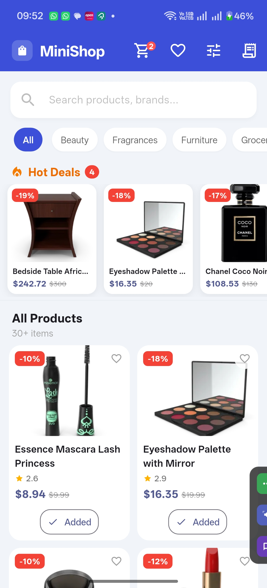
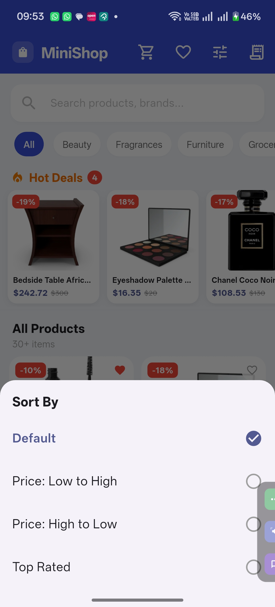
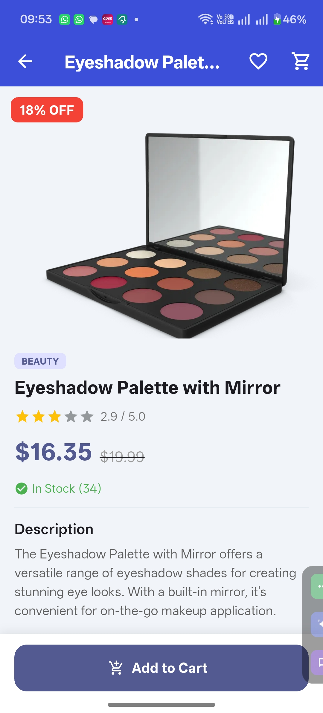
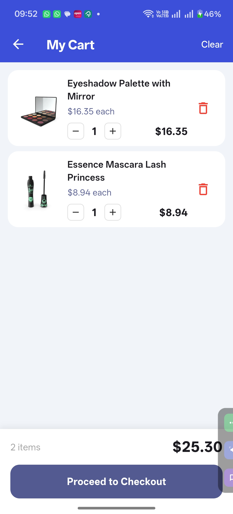
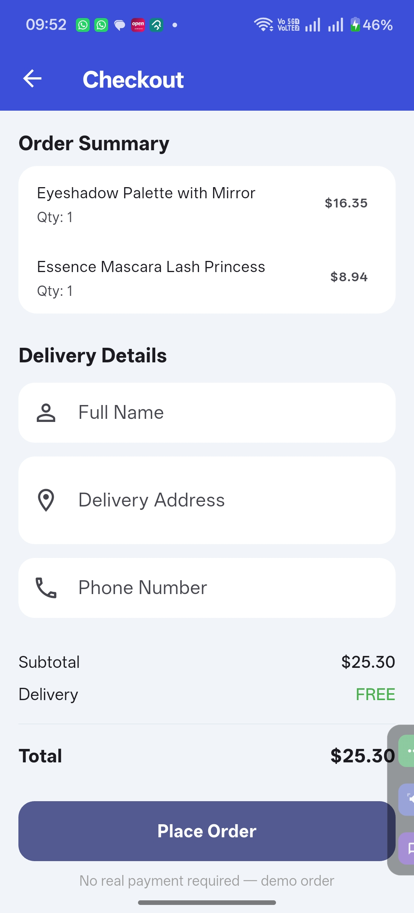
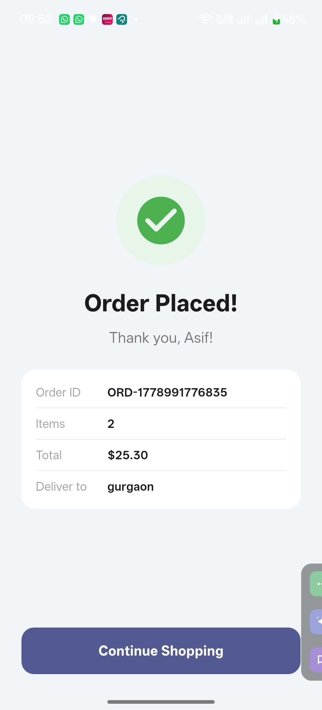
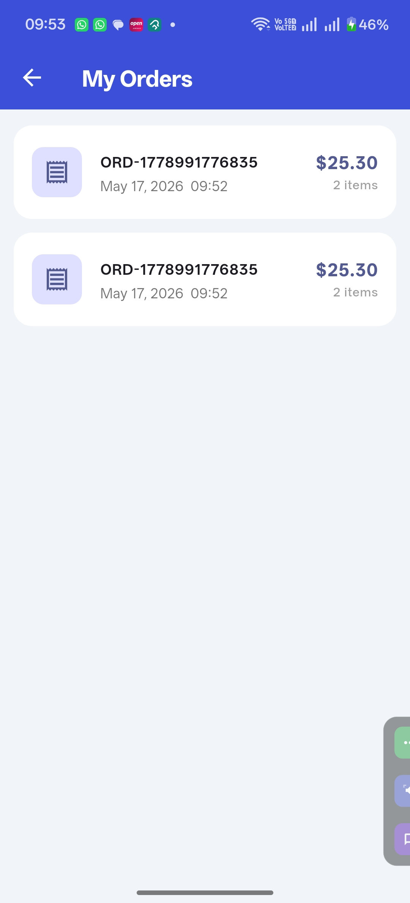
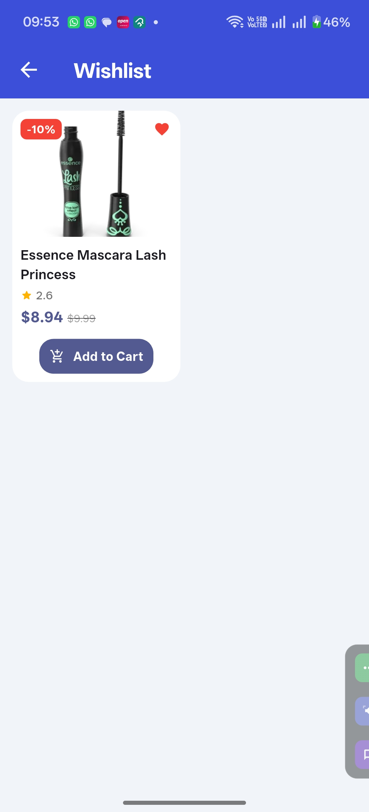

# MiniShop

A Flutter e-commerce Android app demonstrating a complete end-to-end shopping flow — catalog → product detail → cart → checkout → order confirmation — built with **MVP architecture** and **Material Design 3**.

---

## Screenshots

### Home Screen
Browse 194 products in a responsive grid. Hot Deals strip highlights top discounts. Category chips and live search filter the catalog instantly.

<p float="left">
  
  &nbsp;&nbsp;
  
</p>

---

### Product Detail
Full image gallery with thumbnail strip, star rating, discounted price badge, stock level, and similar-products carousel.

<p float="left">
  
</p>

---

### Cart
Per-item quantity controls, line totals, cart total, and one-tap checkout. Cart survives app restarts via SharedPreferences.

<p float="left">
  
</p>

---

### Checkout
Order summary with delivery form (name, address, phone). Full validation before the order is placed.

<p float="left">
  
</p>

---

### Order Confirmation
Unique order ID, customer name, delivery address, and itemised order summary shown after a successful purchase.

<p float="left">
  
</p>

---

### Order History
All past orders in a scrollable list. Each card shows order ID, date, total, and expandable item breakdown.

<p float="left">
  
</p>

---

### Wishlist
Heart-toggle on every product card saves items to a persistent wishlist grid, rehydrated on next launch.

<p float="left">
  
</p>

---

## Tech Stack

| Layer | Technology |
|---|---|
| Framework | Flutter 3.x (Dart 3.10+) |
| Architecture | MVP — Model / Repository / Presenter / View |
| State Management | Provider (`ChangeNotifier` + interfaces) |
| Networking | `http` package |
| Image Caching | `cached_network_image` |
| Local Persistence | `shared_preferences` (cart, wishlist, orders) |
| Skeleton Loading | `shimmer` |
| Ratings UI | `flutter_rating_bar` |
| Connectivity | `connectivity_plus` |
| Data Source | [DummyJSON](https://dummyjson.com) public API |

---

## Architecture

The app follows **MVP (Model–View–Presenter)**. Views never hold business logic; presenters expose immutable state via `ChangeNotifier`; repositories abstract all data access.

```
lib/
├── main.dart                        # App entry, MultiProvider setup
├── models/
│   ├── product.dart                 # Product — fromJson / toJson
│   ├── cart_item.dart               # CartItem (product + quantity) — fromJson / toJson
│   └── order.dart                   # Placed order — fromJson / toJson
├── contracts/
│   ├── products_contract.dart       # IProductsPresenter, LoadState, SortOption
│   ├── cart_contract.dart           # ICartPresenter
│   ├── wishlist_contract.dart       # IWishlistPresenter
│   └── orders_contract.dart        # IOrdersPresenter
├── repositories/
│   └── product_repository.dart     # Thin wrapper — delegates to ApiService
├── services/
│   └── api_service.dart            # HTTP client (DummyJSON), typed ApiException
├── presenters/
│   ├── products_presenter.dart     # Catalog, search, categories, sort, pagination
│   ├── cart_presenter.dart         # Cart CRUD + SharedPreferences persistence
│   ├── wishlist_presenter.dart     # Wishlist toggle + SharedPreferences persistence
│   └── orders_presenter.dart      # Order history + SharedPreferences persistence
├── screens/
│   ├── home_screen.dart            # Product grid, search, category chips, deals strip
│   ├── product_detail_screen.dart  # Image gallery, rating, add-to-cart, similar products
│   ├── cart_screen.dart            # Cart list, qty controls, checkout CTA
│   ├── checkout_screen.dart        # Order form, validation, place order
│   ├── order_success_screen.dart   # Confirmation with order details
│   ├── wishlist_screen.dart        # Saved products grid
│   └── orders_screen.dart         # Order history with expandable cards
├── widgets/
│   ├── product_card.dart           # Grid card with discount badge, wishlist toggle
│   ├── skeleton_loader.dart        # Shimmer skeleton for loading state
│   ├── error_view.dart             # Error + retry UI / empty state UI
│   ├── connectivity_banner.dart    # Animated offline banner
│   ├── deals_section.dart          # Horizontal hot-deals strip (≥15% off)
│   └── sort_bottom_sheet.dart      # Sort options bottom sheet
└── theme/
    └── app_theme.dart              # Material 3 theme (colours, shapes)
```

**State flow:** All screens `watch` / `read` a presenter via `Provider`. No `setState` for business logic. Cart, wishlist, and orders are serialised to JSON and persisted via `SharedPreferences` on every mutation, then rehydrated on app start.

---

## Features

### Core
- Product catalog — infinite-scroll grid loaded from REST API
- Product detail — image gallery with thumbnail strip, star rating, stock status, discount badge
- Add to Cart with quantity controls on both the detail screen and the cart
- Cart — per-item totals, cart total, quantity +/−, swipe-to-delete, clear-all
- Cart persisted across app restarts
- Checkout — name / address / phone form with validation, full order summary
- Order confirmation screen with unique order ID
- Loading skeleton UI and error state with retry button

### Bonus
- Category filter chips (30+ categories fetched from API)
- Full-text search with 500 ms debounce
- Sort by: Default / Price Low→High / Price High→Low / Top Rated
- Hot Deals strip — products with ≥ 15 % discount, sorted by discount %
- Wishlist — heart toggle on every card, persisted offline
- Order history — all past orders with itemised breakdown
- Similar products carousel on the detail screen (same category, lazy-loaded)
- Connectivity banner — animated "No internet" bar appears / disappears live

---

## Unit Tests

61 unit tests covering all presenters, models, and the service layer.

```bash
flutter test
# 61 tests — all passing
```

Tests live in `test/` and use a `_FakeRepository` to avoid real HTTP calls.

---

## Setup & Running

### Prerequisites
- Flutter SDK ≥ 3.10 — [Install Flutter](https://docs.flutter.dev/get-started/install)
- Android Studio or VS Code with Flutter extension
- Android emulator or physical device (Android 5.0+ / minSdk 21)

### Steps

```bash
# 1. Clone
git clone https://github.com/asifsaifi92/miniShop.git
cd miniShop

# 2. Install dependencies
flutter pub get

# 3. Run
flutter run

# 4. Build release APK
flutter build apk --release
# → build/app/outputs/flutter-apk/app-release.apk
```

No API keys or environment variables required — the app works immediately.

---

## API

**DummyJSON** — `https://dummyjson.com`

| Endpoint | Purpose |
|---|---|
| `GET /products?limit=30&skip=N` | Paginated product catalog |
| `GET /products/categories` | Category chip list |
| `GET /products/category/:slug` | Filter by category |
| `GET /products/search?q=:query` | Full-text search |

194 products across 30+ categories. Fetched 30 at a time with infinite scroll.

---

## Permissions

```xml
<uses-permission android:name="android.permission.INTERNET"/>
<uses-permission android:name="android.permission.ACCESS_NETWORK_STATE"/>
```

No location, contacts, storage, or camera permissions.

---

## Limitations & Trade-offs

| Decision | Rationale |
|---|---|
| Provider over Bloc / Riverpod | Simpler for a demo; presenters are behind interfaces so swapping is straightforward |
| DummyJSON | Zero setup; 194 real products with images, ratings, discounts |
| SharedPreferences for persistence | Sufficient for key-value JSON; SQLite / Isar would be better for larger datasets |
| `http` over Dio | No interceptors or retry logic needed; keeps the dependency tree minimal |

**Future scope:** user authentication, SQLite order history, push notifications, product reviews, dark mode, deep links.
